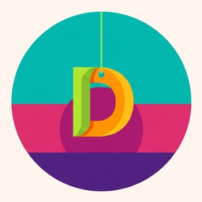

<div align="center">



# Danglings

**Tiny lucky charms that dangle from the top of your screen.**

It hangs from a thread at the top of your screen, sways with a little wind, and reacts when you click it. Pick a charm rooted in a real tradition — or hang your own emoji instead.

</div>

---

## What it is

Danglings is a transparent, always-on-top desktop overlay. A single charm hangs on a swinging, physically-simulated thread — drag it, flick it, or just let it sway. Click it to trigger its **ritual** (a small animation + sound), or right-click to open the picker and choose a different charm.

- 🧿 **Nazar Boncuğu** (Turkey & the Levant) — spin it to ward off the evil eye
- 🪬 **Hamsa** (Middle East & North Africa) — flick it away for good fortune
- 🍀 **Four-Leaf Clover** (Ireland) — rub it for luck
- 🐱 **Maneki-neko** (Japan) — tap its paw
- 🪲 **Scarab** (Egypt) — turn it over
- 🐘 **Ganesha** (India) — clear the path
- 福 **Fu** (China) — flip it upside down
- 🌶️🍋 **Nimbu-mirchi** (India) — hang a fresh garland
- 👺 **Drishti bommai** (India) — stare it down
- 🪢 **Pánchángjié** (China) — spin the tassel
- ✨ or type any emoji of your own

The window is click-through everywhere except the charm itself, so it never gets in the way of whatever you're actually doing.

## Tech stack

Built with [Tauri](https://tauri.app/) (Rust) for the desktop shell, [React](https://react.dev/) + TypeScript for the UI, and [Vite](https://vitejs.dev/) for the dev/build tooling. The rope/thread physics are a small custom simulation ([`src/useRope.ts`](src/useRope.ts)).

## Getting started

**Prerequisites:** [Node.js](https://nodejs.org/), [Rust](https://www.rust-lang.org/tools/install), and the [Tauri system dependencies](https://tauri.app/start/prerequisites/) for your OS.

```bash
# install dependencies
npm install

# run in development mode
npm run tauri dev

# build a release bundle
npm run tauri build
```

## Contributing

Issues and PRs are welcome — new charms, new rituals, and bug fixes especially.

## License

[MIT](LICENSE)
